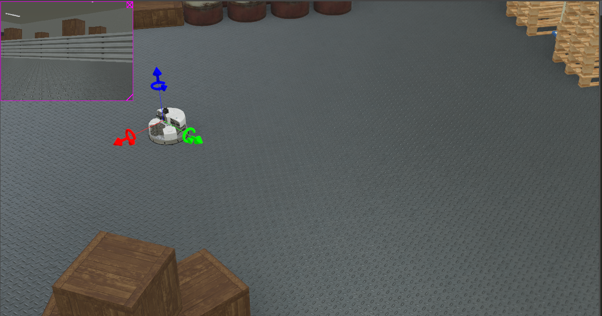
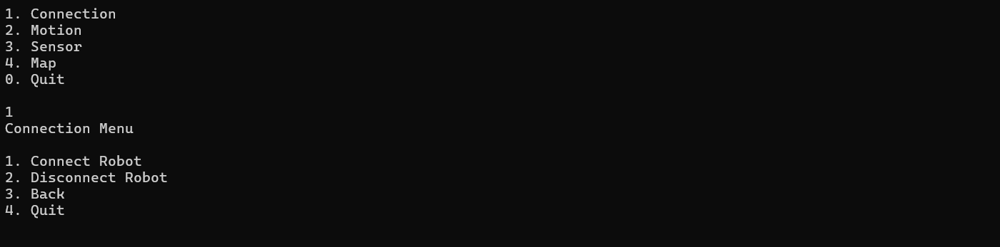
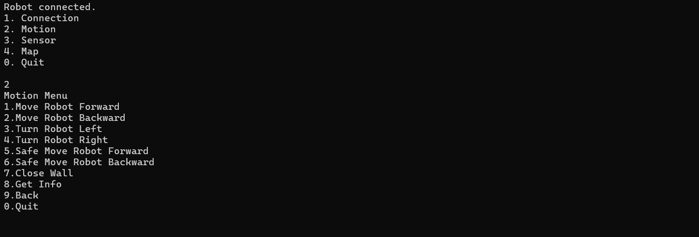
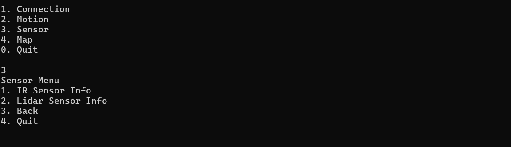
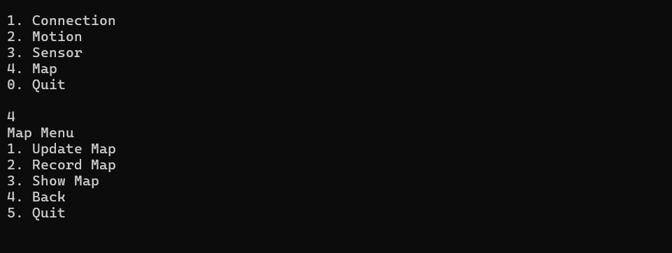

# 🤖 Omni-Directional Robot Control System

Welcome to the **Omni-Directional Robot Control System** project! This README will guide you through the purpose of the project, its setup, and usage instructions.

---

## 📖 Project Overview


This project involves creating a software system to control an omni-directional robot using the Webots simulation environment. The software allows:

- **Robot movement** in multiple directions.
- **Sensor data retrieval** from IR and Lidar sensors.
- **Safe navigation** avoiding obstacles.
- **Map creation** based on robot exploration.

The project leverages **Object-Oriented Programming (OOP)** principles, including abstraction, inheritance, polymorphism, and exception handling. As the project progresses, a second phase revises the initial implementation to include improved class designs and new functionalities, such as enhanced sensor management and access control mechanisms.

---

## 🛠 Features

1. **Robot Control**

   - Move forward, backward, left, right, and rotate.
   - Retrieve real-time position data.

2. **Sensor Management**

   - IR Sensor: Infrared distance measurements.
   - Lidar Sensor: Distance and angle measurements.

3. **Navigation**

   - Safe navigation with obstacle detection.

4. **Mapping**

   - Visualize and save the explored environment.

5. **Access Control**

   - Enable or disable robot functionalities using secure authentication.

6. **User Menu**
   - Interactive text-based menu for robot operations.

---

## 🧑‍💻 Installation and Setup

Follow these steps to set up the project:

### Prerequisites

1. **Webots Simulator**

   - Download and install Webots from [Cyberbotics](https://cyberbotics.com). Use version R2023b.

2. **Development Environment**
   - A C++ compiler (e.g., GCC or MSVC).
   - Recommended IDE: Visual Studio Community 2022.

### Setup Steps

1. Clone the repository or download the source code.

   ```bash
   git clone <repository-url>
   ```

2. Place the provided `FestoRobotAPI.h` and `FestoRobotAPI.lib` files in the appropriate directories.

3. Open the project in your IDE and configure the build settings:

   - Include directories for headers: `C:\Program Files\Webots\include\controller\cpp`.
   - Link the `FestoRobotAPI.lib` and `Controller.lib` libraries.

4. Build the project to ensure all dependencies are resolved.

5. Follow [EK-1](https://github.com/cemlevent54/FestoRobot-Control-System/blob/main/documentations/EK_1_Gelistirme_Ortaminin_Olusturulmasi_v1_0.pdf) for detailed setup instructions, including testing the simulator integration.

---

## 🎮 Usage

1. **Run the Application**

   - Execute the compiled binary.

2. **Use the Menu**

   - Navigate through the main menu to:
     - Connect/Disconnect the robot.
     - Move the robot in various directions.
     - View sensor data.
     - Map the environment.
     - Enable or disable access control.

3. **View Logs**
   - Check the console for real-time feedback and updates.

---

### Menu Interaction

1. **Robot Connection Menu:**
   Below is an example of the connection menu:
   

2. **Motion Menu:**
   Here’s an example of controlling robot motion:
   

3. **Sensor Data:**
   Example of sensor data display:
   

4. **Mapping Example:**
   Example view of the mapping functionality:
   

## 🧩 Project Structure

- **`FestoRobotAPI.h`**: Core API for robot communication.
- **`FestoRobotInterface.*`**: Interface for robot control.
- **`IRSensor.*`**: Manages IR sensor data.
- **`LidarSensor.*`**: Handles Lidar sensor data.
- **`Pose.*`**: Represents the robot's position and orientation.
- **`Mapper.*`**: Creates and manages maps.
- **`SafeNavigation.*`**: Ensures collision-free movement.
- **`RobotControler.*`**: Revised for access control and enhanced sensor management.

## 🌟 Highlights

- **OOP Best Practices**
- **Doxygen Documentation** for code clarity.
- **Real-time Simulation** with Webots.
- **Comprehensive Testing** for robust implementation.
- **Enhanced Security** through access control.

---

## ▶️ Project Demo

## [](https://www.youtube.com/watch?v=eefAAi1ej_0)

## 🤝 Contributors

- Cem Levent Avcı and Team 🌟

---

## 📧 Support

For any questions or issues, please contact us at **cemlevent54@gmail.com**.

---

Enjoy exploring and controlling your omni-directional robot! 🤖
